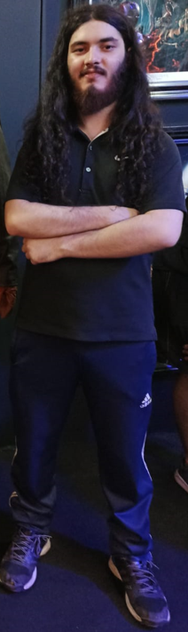

# Tomás José Giampauli

### Saludos, soy Tomás José Giampauli estudiante de Ingeniería en Sistemas de la Información en la UTN Regional Buenos Aires

####Legajo:1730691

Actualmente me encuentro estudiando esta carrera debido a mi interés en la tecnología, con la que curiosamente no me llevo bien, junto a mi interés por la inteligencia artificial. Inicialmente me interesé por la facultad para arrancar en Ingeniería naval, pero a último momento y por diferentes cosas que pasaron en mi cabeza me pasé a sistemas.

Fuera de la facultad trabajo en una ferretería, y más allá de eso paso el tiempo estudiando, viendo series o películas y sino en juegos con amigos.
